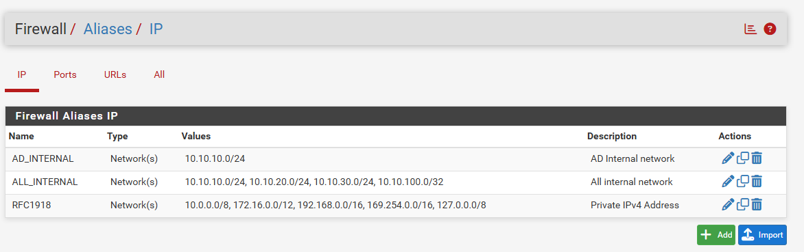
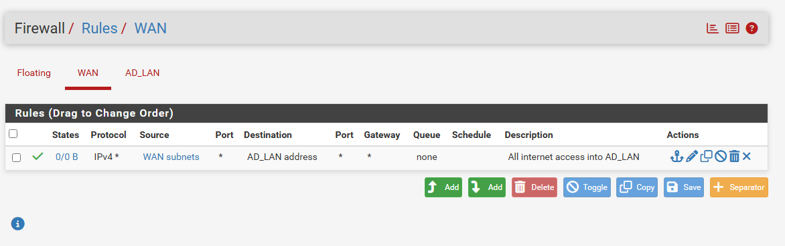
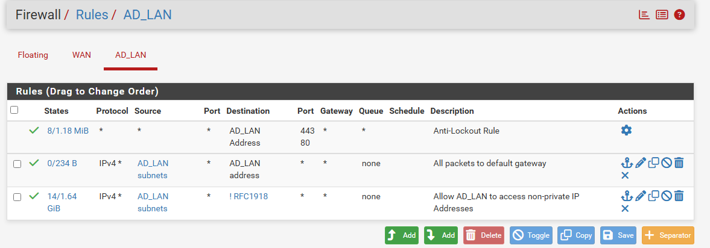

# Pfsense

This file includes all the most up-to-date setup for pfsense router in my lab.

## Interfaces
- WAN (Bridge Mode): 192.168.0.128?24
- AD_LAN (Internal Network): 10.10.10.1/24

## Firewall Aliases

## Firewall rules
### WAN 

### AD_LAN
