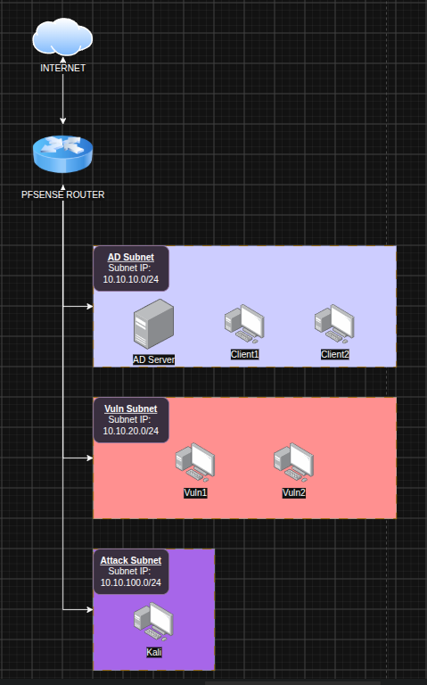

# Personal-NV-research

## Objective
- Practice Network/SysAdmin setup
- To better understand network work visualisation
- Gain appreciation of deep packet inspection

## Network Setup:

## To-do:
- [x] Setup Pfsense (Create WAN and AD firewall rules)
- [ ] Setup AD server
- [ ] Setup Client 1 and 2 to join AD
